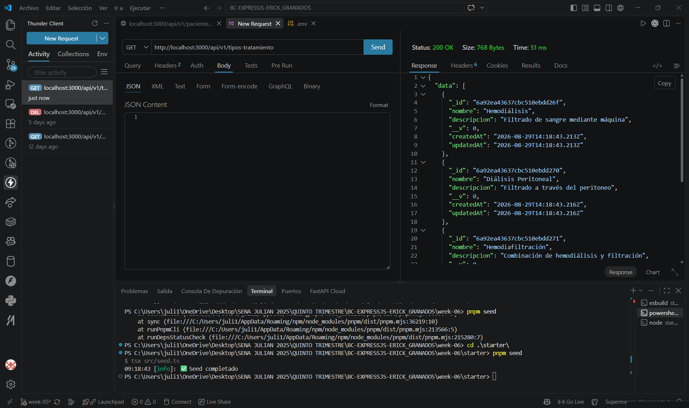
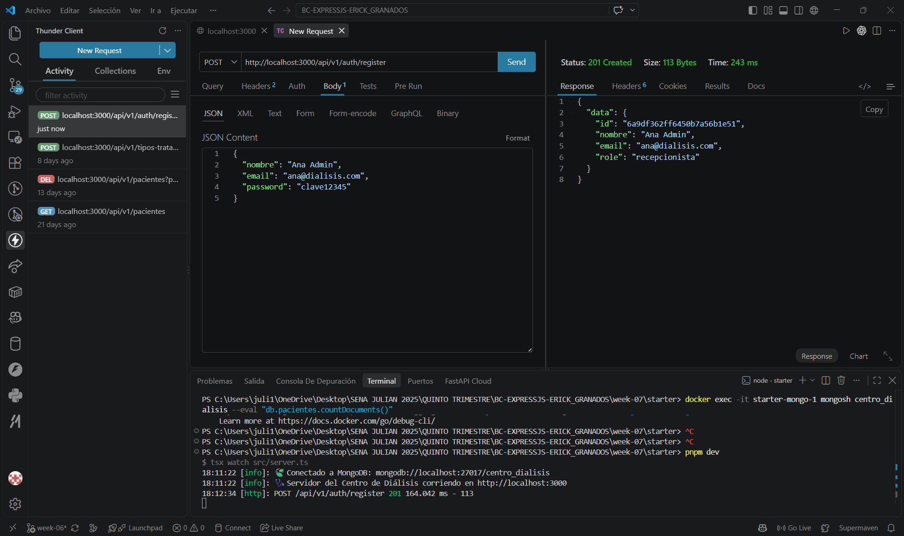
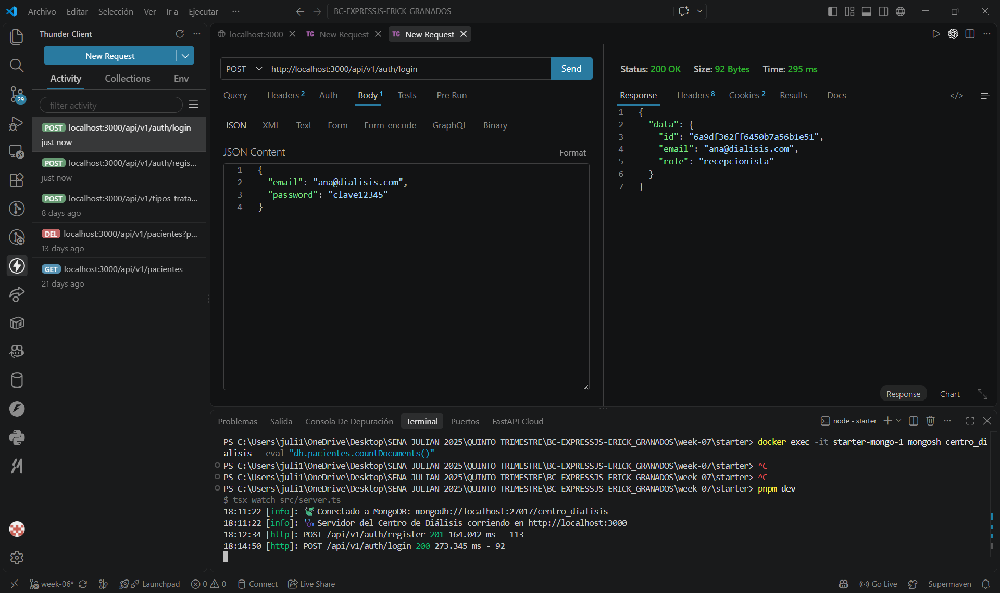
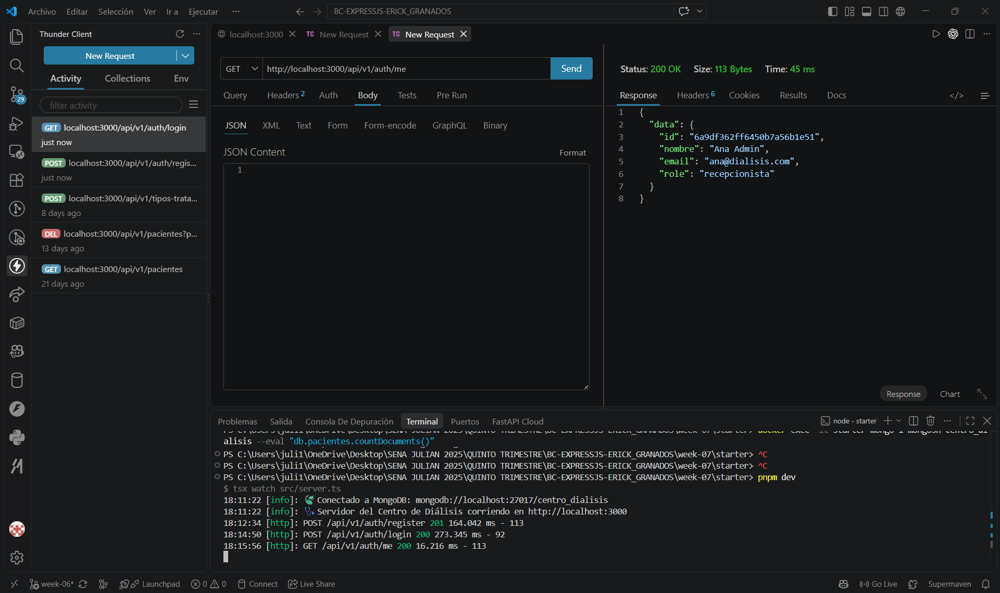
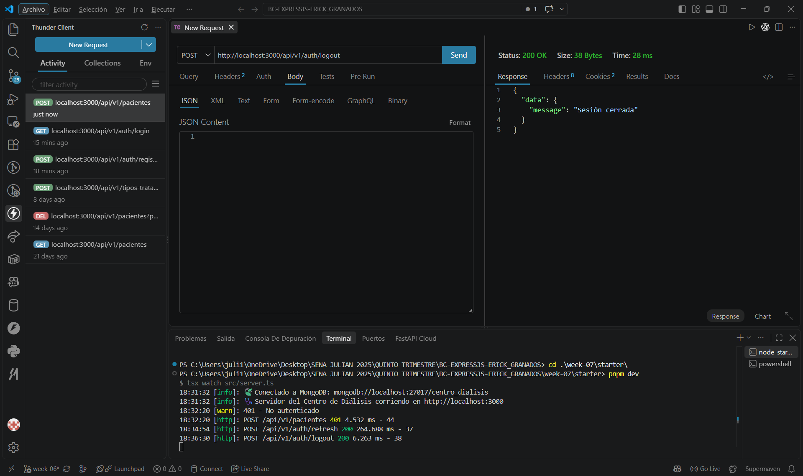

#   API con Autenticación JWT Completa — Centro de Diálisis

API REST construida con **Express 5 + TypeScript + Mongoose**, con autenticación completa (registro, login, refresh con rotación, logout) usando **bcrypt** + **JWT** en cookies HttpOnly, protegiendo el CRUD del recurso principal del dominio.

## Dominio asignado
Centro de Diálisis

## Recurso protegido: `Paciente`

| Campo | Tipo | Descripción |
|---|---|---|
| `nombre` | `String` | Nombre completo del paciente |
| `turno` | `"mañana" \| "tarde" \| "noche"` | Turno asignado |
| `tipoTratamiento` | `"hemodialisis" \| "dialisis_peritoneal" \| "hemodiafiltracion"` | Tipo de tratamiento |
| `costoSesion` | `Number` | Costo de cada sesión |
| `diasPorSemana` | `Number` | Días a la semana que asiste |
| `activo` | `Boolean` | Si continúa en tratamiento |
| `registradoPor` | `ObjectId` (ref: `User`) | Usuario que registró al paciente |

## Modelo `User`

| Campo | Tipo | Notas |
|---|---|---|
| `nombre` | `String` | — |
| `email` | `String` (único) | — |
| `password` | `String` | Hasheada con bcrypt, `select: false` |
| `role` | `"admin" \| "recepcionista"` | Roles del centro |
| `refreshTokenHash` | `String?` | Hash del refresh token vigente, `select: false` |

## 📁 Estructura del proyecto

```
starter/
├── docker-compose.yml
├── package.json
├── tsconfig.json
├── pnpm-workspace.yaml
├── .env.example
└── src/
    ├── env.ts                          # Carga .env ANTES que cualquier otro módulo
    ├── lib/mongoose.ts
    ├── config/logger.ts
    ├── errors/AppError.ts
    ├── types/express.d.ts              # Tipado global de req.user
    ├── utils/jwt.ts                    # sign/verify access + refresh
    ├── middlewares/
    │   ├── auth.middleware.ts
    │   ├── notFound.ts
    │   └── errorHandler.ts
    ├── models/
    │   ├── user.model.ts
    │   └── paciente.model.ts
    ├── schemas/
    │   ├── auth.schema.ts
    │   └── paciente.schema.ts
    ├── repositories/
    │   ├── users.repository.ts
    │   └── pacientes.repository.ts
    ├── services/
    │   ├── auth.service.ts
    │   └── pacientes.service.ts
    ├── controllers/
    │   ├── auth.controller.ts
    │   └── pacientes.controller.ts
    ├── routes/
    │   ├── auth.routes.ts
    │   └── pacientes.routes.ts
    ├── app.ts
    └── server.ts
```

##  Cómo correr el proyecto

```bash
docker compose up -d
pnpm install
cp .env.example .env
# Editar .env con tus propios secrets JWT
pnpm dev
```

##   Nota técnica: orden de carga de variables de entorno

Node.js hace *hoisting* de todos los `import` estáticos al inicio del módulo, sin importar el orden en que se escriban en el código. Esto causaba que `loadEnvFile()` se ejecutara **después** de que `jwt.ts` ya hubiera leído `process.env.JWT_ACCESS_SECRET` como `undefined` (al cargarse como dependencia de `app.ts`). Solución: se aisló la carga de variables en `src/env.ts`, importado como el **primer** import estático en `server.ts`, y el resto de los módulos (`app`, `mongoose`, `logger`) se cargan con `import()` dinámico para forzar el orden real de ejecución.

##   Endpoints de autenticación

| Método | Ruta | Descripción | Status |
|--------|------|-------------|--------|
| POST | `/api/v1/auth/register` | Registro con hash de contraseña | 201 / 409 |
| POST | `/api/v1/auth/login` | Login, emite cookies HttpOnly | 200 / 401 |
| GET | `/api/v1/auth/me` | Perfil del usuario autenticado | 200 / 401 |
| POST | `/api/v1/auth/refresh` | Renueva tokens con rotación | 200 / 401 |
| POST | `/api/v1/auth/logout` | Invalida refresh token y limpia cookies | 200 |

##   Endpoints de `Paciente` (todos protegidos con `authMiddleware`)

| Método | Ruta | Descripción | Status |
|--------|------|-------------|--------|
| GET | `/api/v1/pacientes` | Listar (con `registradoPor` populado) | 200 / 401 |
| GET | `/api/v1/pacientes/:id` | Obtener por ID | 200 / 400 / 401 / 404 |
| POST | `/api/v1/pacientes` | Crear | 201 / 400 / 401 |
| PATCH | `/api/v1/pacientes/:id` | Actualización parcial | 200 / 400 / 401 / 404 |
| DELETE | `/api/v1/pacientes/:id` | Eliminar | 204 / 400 / 401 / 404 |

##   Criterios de seguridad implementados

| Criterio | Implementación |
|---|---|
| Contraseñas hasheadas | `bcrypt.hash()` con 10 salt rounds |
| Secrets distintos | `JWT_ACCESS_SECRET` ≠ `JWT_REFRESH_SECRET` |
| Tokens en cookies HttpOnly | `httpOnly: true`, `sameSite: "strict"`, nunca en body ni localStorage |
| Refresh token hasheado en DB | Solo se guarda `refreshTokenHash`, nunca el token en claro |
| Rotación de refresh token | Cada `/refresh` genera un nuevo hash y descarta el anterior |
| Rutas protegidas | `pacientesRouter.use(authMiddleware)` protege las 5 rutas del recurso |
| Sin secrets hardcodeados | Todos los secrets viven en `.env` |

##   Flujo de prueba completo (verificado)

| # | Caso | Resultado |
|---|---|---|
| 1 | Register | 201 |
| 2 | Login (con cookies `accessToken`/`refreshToken`) | 200 |
| 3 | GET /me autenticado | 200 |
| 4 | Crear paciente sin cookies | 401 — "Token inválido o expirado" |
| 5 | Crear paciente autenticado | 201, con `registradoPor` |
| 6 | Refresh con cookie válida | 200 — "Token renovado" |
| 7 | Logout | 200 — "Sesión cerrada" |
| 8 | Refresh después de logout | 401 — "No hay refresh token" |

## Captures de pantalla
### get 200

### invalid id 400

### Paciente válido 201

### Paciente duplicado 409

### Registro 201

### Login 200

### get me 200

### crear paciente sin login 401

### crear paciente con login 201

### logout 200

### refresh con cookie válido 200
  

## ✅ Cumplimiento de requisitos

| Requisito | Estado |
|---|---|
| Register con hash bcrypt | ✅ |
| Login con cookies HttpOnly | ✅ |
| GET /me protegido | ✅ |
| Refresh con rotación | ✅ |
| Logout invalida sesión | ✅ |
| CRUD completo del recurso, protegido con authMiddleware | ✅ |
| `pnpm build` sin errores TypeScript | ✅ |

## Autor

- **Nombre:** Julián Esneyde Machado Garzón
- **Ficha:** 3228973B
- **GitHub:** [@JulianMg20](https://github.com/JulianMg20)
- **Programa:** Análisis y Desarrollo de Software (ADSI)
- **Trimestre:** 5
- **Instructor:** Erick Granados
- **Motor de base de datos (este trimestre):** MongoDB (con Mongoose)