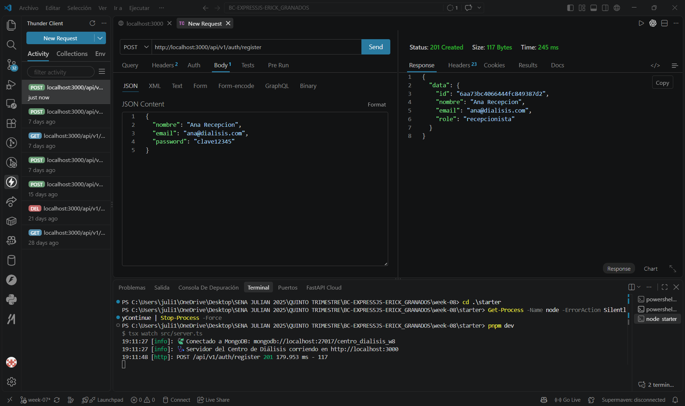

# 🩺 API Segura con RBAC y Capas de Seguridad — Centro de Diálisis

API REST construida con **Express 5 + TypeScript + Mongoose**, que añade control de acceso por roles (RBAC) y varias capas de seguridad HTTP (Helmet, CORS con whitelist, rate limiting diferenciado, sanitización de entradas) sobre la autenticación JWT de la semana anterior.

## Dominio asignado
Centro de Diálisis

## Recurso protegido: `Paciente`

| Campo | Tipo | Descripción |
|---|---|---|
| `nombre` | `String` | Nombre completo del paciente |
| `codigoExpediente` | `String` (único) | Número de expediente médico |
| `turno` | `"mañana" \| "tarde" \| "noche"` | Turno asignado |
| `tipoTratamiento` | `"hemodialisis" \| "dialisis_peritoneal" \| "hemodiafiltracion"` | Tipo de tratamiento |
| `costoSesion` | `Number` | Costo de cada sesión |
| `diasPorSemana` | `Number` | Días a la semana que asiste |
| `activo` | `Boolean` | Si continúa en tratamiento |
| `registradoPor` | `ObjectId` (ref: `User`) | Usuario que registró al paciente |

##   Roles y permisos

| Rol | Listar / Ver | Crear | Actualizar | Eliminar |
|---|---|---|---|---|
| `recepcionista` | ✅ | ✅ | ✅ | ❌ (403) |
| `admin` | ✅ | ✅ | ✅ | ✅ |

Todas las rutas del recurso requieren estar autenticado (`authMiddleware`); `DELETE` requiere además el rol `admin` (`requireRole("admin")`).

## 📁 Estructura del proyecto

```
starter/
├── docker-compose.yml     # incluye `name:` explícito para aislar volúmenes por semana
├── package.json
├── tsconfig.json
├── pnpm-workspace.yaml
├── .env.example
└── src/
    ├── env.ts
    ├── lib/mongoose.ts
    ├── config/
    │   ├── logger.ts
    │   └── security.ts           # Helmet, CORS whitelist, rate limiters, sanitización
    ├── errors/AppError.ts
    ├── types/express.d.ts
    ├── utils/jwt.ts
    ├── middlewares/
    │   ├── auth.middleware.ts
    │   ├── role.middleware.ts    # requireRole(...roles)
    │   ├── notFound.ts
    │   └── errorHandler.ts
    ├── models/
    │   ├── user.model.ts
    │   └── paciente.model.ts
    ├── schemas/
    │   ├── auth.schema.ts
    │   └── paciente.schema.ts
    ├── repositories/
    │   ├── users.repository.ts
    │   └── pacientes.repository.ts
    ├── services/
    │   ├── auth.service.ts
    │   └── pacientes.service.ts
    ├── controllers/
    │   ├── auth.controller.ts
    │   └── pacientes.controller.ts
    ├── routes/
    │   ├── auth.routes.ts
    │   └── pacientes.routes.ts
    ├── app.ts
    └── server.ts
```

##  Cómo correr el proyecto

```bash
docker compose up -d
pnpm install
cp .env.example .env
pnpm dev
```

##  Nota técnica: `express-mongo-sanitize` incompatible con Express 5

La librería `express-mongo-sanitize@2.2.0` intenta reasignar `req.query` directamente, pero en Express 5 esa propiedad es de solo lectura (getter sin setter), lo que provocaba `TypeError: Cannot set property query of #<IncomingMessage> which has only a getter`. Se reemplazó por una función de sanitización propia en `src/config/security.ts` que limpia recursivamente `req.body` y `req.params` (eliminando claves que empiecen con `$` o contengan `.`), sin tocar `req.query`.

##  Capas de seguridad implementadas

| Capa | Herramienta | Propósito |
|---|---|---|
| Headers de seguridad | `helmet()` | `X-Content-Type-Options: nosniff`, `X-Frame-Options`, CSP, HSTS, etc. |
| CORS restringido | `cors()` con función `origin` + whitelist desde `CORS_ORIGIN` | Evita que orígenes no autorizados usen la API con cookies |
| Rate limiting diferenciado | `express-rate-limit` | `/auth`: 5 peticiones / 15 min; resto de la API: 100 / 15 min |
| Sanitización de entradas | Función propia (recursiva) | Elimina operadores Mongo (`$`, `.`) de `body`/`params` |
| RBAC | `authMiddleware` + `requireRole()` | Protege rutas por autenticación y por rol |
| Sin stack trace en producción | `errorHandler` condicional a `NODE_ENV` | El stack solo se incluye en la respuesta cuando `NODE_ENV !== "production"` |

## 🔌 Endpoints

### Auth (con `authRateLimiter`: 5 req / 15 min)

| Método | Ruta | Descripción |
|--------|------|-------------|
| POST | `/api/v1/auth/register` | Registro |
| POST | `/api/v1/auth/login` | Login con cookies HttpOnly |
| GET | `/api/v1/auth/me` | Perfil autenticado |
| POST | `/api/v1/auth/refresh` | Renovación con rotación |
| POST | `/api/v1/auth/logout` | Cierre de sesión |

### Pacientes (con `generalRateLimiter`: 100 req / 15 min)

| Método | Ruta | Acceso requerido | Status |
|--------|------|-------------------|--------|
| GET | `/api/v1/pacientes` | Autenticado | 200 / 401 |
| GET | `/api/v1/pacientes/:id` | Autenticado | 200 / 400 / 401 / 404 |
| POST | `/api/v1/pacientes` | Autenticado | 201 / 400 / 401 / 409 |
| PATCH | `/api/v1/pacientes/:id` | Autenticado | 200 / 400 / 401 / 404 |
| DELETE | `/api/v1/pacientes/:id` | **Admin** | 204 / 401 / 403 / 404 |

## Captura de pantalla

### Headers de Helmet en toda respuesta


### Rate limit de auth


### Register


### Login (cookies `accessToken`/`refreshToken`)


### Crear deleted paciente


### Crear deleted paciente como admin
  

##   Flujo de prueba verificado

| # | Caso | Resultado |
|---|---|---|
| 1 | Headers de Helmet en toda respuesta (`x-content-type-options: nosniff`) | ✅ |
| 2 | Rate limit de auth: 6º intento en 15 min → 429 | ✅ |
| 3 | Register | ✅ 201 |
| 4 | Login (cookies `accessToken`/`refreshToken`) | ✅ 200 |
| 5 | Crear paciente autenticado | ✅ 201, con `registradoPor` |
| 6 | DELETE como `recepcionista` | ✅ 403 — "No tienes permisos para esta acción" |
| 7 | DELETE como `admin` (tras actualizar el rol) | ✅ 204 |

## ✅ Cumplimiento de requisitos

| Requisito | Estado |
|---|---|
| Helmet aplicado y headers visibles | ✅ |
| RBAC funcional (401 sin token, 403 con rol incorrecto, 204 con rol correcto) | ✅ |
| Rate limiting con 429 al exceder límite | ✅ |
| CORS con whitelist (no `cors()` puro) | ✅ |
| NoSQL injection mitigado (sanitización de body/params) | ✅ |
| Errores sin stack trace en producción | ✅ (condicional a `NODE_ENV`) |
| `pnpm build` sin errores TypeScript | ✅ |

##   Autor

- **Nombre:** Julián Esneyde Machado Garzón
- **Ficha:** 3228973B
- **GitHub:** [@JulianMg20](https://github.com/JulianMg20)
- **Programa:** Análisis y Desarrollo de Software (ADSI)
- **Trimestre:** 5
- **Instructor:** Erick Granados
- **Motor de base de datos :** MongoDB  